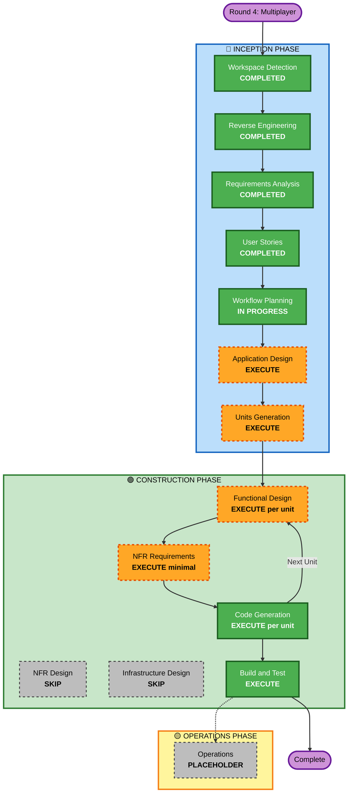

# Execution Plan（Round 4 - 多人版数独）

## Detailed Analysis Summary

### Transformation Scope (Brownfield)
- **Transformation Type**: Architectural transformation（纯前端 SPA → 前端 + WebSocket 后端的双进程应用）
- **Primary Changes**: 新增 Node.js + TypeScript + ws 后端服务（房间/匹配/权威状态）；前端新增模式选择、网络层、联机对局适配；共享消息协议
- **Related Components**: 既有 `core/`（GameState/GameController 需支持"远程操作来源"与旁观）、`scenes/`（MenuScene 模式选择、GameScene 联机适配）、`ui/`（加入提示、对方数字颜色）、`persistence/`（本地模式独占，线上不用 localStorage 存档）

### Change Impact Assessment
- **User-facing changes**: Yes — 全新线上模式入口、匹配流程、双人同步对局、加入提示、旁观、断线补位（FR-15~FR-28）
- **Structural changes**: Yes — 新增后端进程；前端从"纯本地状态机"变为"本地模式 + 联机模式双状态源"
- **Data model changes**: Yes — 新增 Room/Player/联机消息协议模型；GameState 需区分操作来源（自己/对方）
- **API changes**: Yes — 新增 WebSocket 消息协议（客户端↔服务端契约）
- **NFR impact**: Yes — 同步延迟 <200ms（NFR-8）；新增 fast-check 属性测试（NFR-9 / PBT-09）

### Component Relationships (Brownfield)
- **Primary Component**: 新增 `server/` 后端包 + 前端 `src/` 联机扩展
- **Shared Components**: 联机消息协议类型（前后端共享，建议 `shared/` 或 server 导出）
- **Dependent Components**: 前端 GameScene/GameController（适配远程操作流）、MenuScene（模式选择）
- **Supporting Components**: package.json 脚本（server dev/build）、vite.config.ts（WS 代理或直连配置）

| 组件 | Change Type | Change Reason | Priority |
|---|---|---|---|
| server/（新增） | Major | 全新后端：房间管理、匹配、权威状态、广播 | Critical |
| shared 消息协议（新增） | Major | 前后端契约 | Critical |
| src/scenes + src/ui | Minor | 模式选择、联机棋盘适配、加入提示、颜色区分 | Critical |
| src/core GameController/GameState | Minor | 操作来源标记、旁观模式、撤销仅限自己 | Critical |
| src/persistence SaveManager | Configuration-only | 线上模式禁用本地存档 | Important |
| tests/ | Minor | 新增服务端与协议测试（含 PBT） | Critical |

### Risk Assessment
- **Risk Level**: Medium（多组件、新增网络协议与实时同步；但局域网/内存态降低了部署与数据风险）
- **Rollback Complexity**: Easy（后端为新增独立包，前端改动可整体回退；本地模式不受影响）
- **Testing Complexity**: Moderate（服务端单测 + 协议 PBT + 双客户端联机集成场景）

## Workflow Visualization



### Text Alternative
```
INCEPTION:  WD(COMPLETED) -> RE(COMPLETED) -> RA(COMPLETED) -> US(COMPLETED)
            -> WP(IN PROGRESS) -> Application Design(EXECUTE) -> Units Generation(EXECUTE)
CONSTRUCTION (per unit, units: server -> client):
            Functional Design(EXECUTE) -> NFR Requirements(EXECUTE minimal)
            -> Code Generation(EXECUTE) -> [next unit] -> Build and Test(EXECUTE)
SKIP:       NFR Design, Infrastructure Design
OPERATIONS: PLACEHOLDER
```

## Phases to Execute

### 🔵 INCEPTION PHASE
- [x] Workspace Detection (COMPLETED)
- [x] Reverse Engineering (COMPLETED)
- [x] Requirements Analysis (COMPLETED)
- [x] User Stories (COMPLETED)
- [x] Workflow Planning (IN PROGRESS)
- [ ] Application Design - EXECUTE（standard depth）
  - **Rationale**: 新增后端服务与多个前端组件，组件方法、消息协议、服务层编排、组件依赖均需先定义
- [ ] Units Generation - EXECUTE（standard depth）
  - **Rationale**: 系统分解为多个工作单元（后端 server + 前端联机 client），存在明确依赖关系（client 依赖 server 的消息协议），需结构化拆分

### 🟢 CONSTRUCTION PHASE
- [ ] Functional Design - EXECUTE（per unit，standard depth）
  - **Rationale**: 大量新业务逻辑：匹配算法、房间状态机、双人规则（独立错误/旁观/笔记互改/撤销仅限自己）、联机消息流；PBT-01 要求在此阶段识别可测属性
- [ ] NFR Requirements - EXECUTE（minimal depth）
  - **Rationale**: PBT-09 要求 fast-check 选型进入技术栈决策；NFR-7/8/9（后端栈/延迟/测试约束）需正式落到单元
- [ ] NFR Design - SKIP
  - **Rationale**: NFR 极简（局域网、内存态、<200ms），无需专门韧性/性能模式；Security/Resiliency 扩展均 opt-out
- [ ] Infrastructure Design - SKIP
  - **Rationale**: 无云资源与部署架构；本机/局域网运行形态（端口、启动脚本）在 Code Generation 计划中处理即可
- [ ] Code Generation - EXECUTE（ALWAYS，per unit）
  - **Rationale**: 实现规划与代码生成
- [ ] Build and Test - EXECUTE（ALWAYS）
  - **Rationale**: 构建、单测（含 PBT）、双客户端联机集成验证

### 🟡 OPERATIONS PHASE
- [ ] Operations - PLACEHOLDER
  - **Rationale**: 占位阶段

## Package/Unit Change Sequence (Brownfield)
- **Update Approach**: Sequential（关键路径：协议 → 后端 → 前端）
- **Critical Path**: 共享消息协议契约（Application Design 产出）→ Unit 1 `sudoku-server` → Unit 2 `sudoku-online-client`
- **Coordination Points**: WebSocket 消息协议（前后端契约，先在 Application Design 冻结）；前端对既有 core/ 的改动不得破坏本地模式（FR-29 回归约束）
- **Testing Checkpoints**: Unit 1 完成后服务端单测 + 协议 PBT；Unit 2 完成后双客户端联机集成场景验证

## Estimated Timeline
- **Total Stages**: 7（Application Design → Units Generation → FD → NFRA → CG×2 units → BT）
- **Estimated Duration**: 单次会话内完成（AI 驱动，无排期）

## Success Criteria
- **Primary Goal**: 两名玩家免登录联机共同完成同一局数独，填数/错填/笔记实时共享，本地模式零回归
- **Key Deliverables**: `server/` 后端（含匹配与权威状态）、前端联机模式、共享消息协议、单元测试 + PBT + 联机集成验证
- **Quality Gates**: tsc 0 错误；vitest 全过（含 fast-check PBT，失败带种子）；vite build 成功；本地模式 US-01~US-14 验收不回归
- **Integration Testing**: 双浏览器客户端连接同一后端的完整对局场景（US-17~US-28 关键路径）
