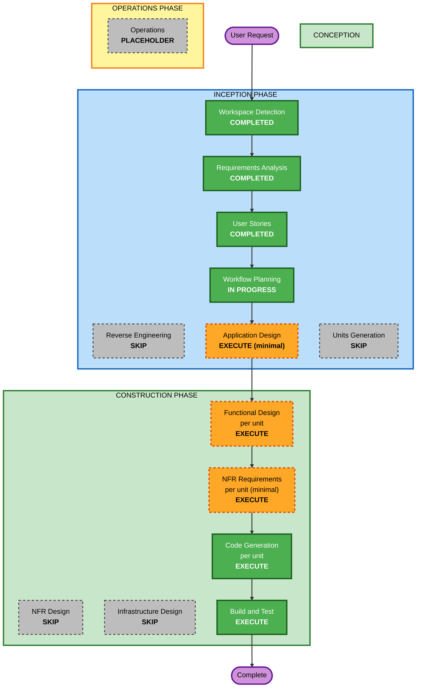

# Execution Plan（Round 5 - 竞速对抗模式）

## Detailed Analysis Summary

### Transformation Scope (Brownfield)
- **Transformation Type**: Multi-component application change（非架构变更，无基础设施变更）
- **Primary Changes**: 线上模式由合作制改为竞速对抗制（FR-31~FR-40）
- **Related Components**: shared-protocol（消息契约变更）、sudoku-server（裁决/计分/房间生命周期）、sudoku-online-client（计分板/结算/私有笔记渲染）；sudoku-game 本地模式不变（FR-40）

### Change Impact Assessment
- **User-facing changes**: Yes——计分板、连击反馈、胜负结算界面、笔记互不可见、错填格反抢
- **Structural changes**: No——组件边界与部署形态不变（沿用 Round 4 三单元结构）
- **Data model changes**: Yes——GameRoom 增加分数/连击状态；笔记改为按玩家私有存储；移除旁观状态
- **API changes**: Yes——shared-protocol 消息变更：opApplied 拆分公开/私有可见性；移除 playerLost；gameWon 扩展为带双方分数的结算广播；补位语义移除
- **NFR impact**: Minimal——NFR-10（PBT 属性方向补充）；实时性/技术栈不变

### Component Relationships
- **Primary Component**: sudoku-server（计分引擎、连击状态机、权限裁决矩阵、离开判胜）
- **Shared Components**: shared-protocol（协议先行，server/client 均依赖）
- **Dependent Components**: sudoku-online-client（消费协议变更，新增计分板/结算 UI）
- **Unaffected Components**: sudoku-game（本地模式，FR-40 回归约束）

| 组件 | 变更类型 | 原因 | 优先级 |
|---|---|---|---|
| shared-protocol | Major（breaking：playerLost 移除、opApplied 可见性拆分） | 契约先行 | Critical |
| sudoku-server | Major | 依赖协议；核心业务规则重构 | Critical |
| sudoku-online-client | Major | 依赖协议与服务端行为 | Critical |
| sudoku-game | None | 本地模式回归约束 | N/A |

### Risk Assessment
- **Risk Level**: Medium（多组件 + 协议 breaking change；但无外部依赖、可整体回滚 git）
- **Rollback Complexity**: Easy（单仓库，git revert 即可）
- **Testing Complexity**: Moderate（PBT 全量执行：计分不变量/权限矩阵/私有笔记/房间状态机；E2E 联调场景需更新为对抗语义）

## Workflow Visualization

### Mermaid Diagram



### Text Alternative

```
INCEPTION: Workspace Detection (COMPLETED) -> RE (SKIP) -> Requirements Analysis (COMPLETED)
  -> User Stories (COMPLETED) -> Workflow Planning (IN PROGRESS)
  -> Application Design (EXECUTE minimal) -> Units Generation (SKIP)
CONSTRUCTION (per unit, sequence: shared-protocol -> sudoku-server -> sudoku-online-client):
  Functional Design (EXECUTE) -> NFR Requirements (EXECUTE minimal) -> NFR Design (SKIP)
  -> Infrastructure Design (SKIP) -> Code Generation (EXECUTE)
Build and Test (EXECUTE) -> Operations (PLACEHOLDER) -> Complete
```

## Phases to Execute

### 🔵 INCEPTION PHASE
- [x] Workspace Detection (COMPLETED 2026-08-10)
- [x] Reverse Engineering (SKIPPED - Round 4 artifacts current)
- [x] Requirements Analysis (COMPLETED 2026-08-10, approved)
- [x] User Stories (COMPLETED 2026-08-10, approved)
- [x] Execution Plan (IN PROGRESS)
- [ ] Application Design - EXECUTE (minimal depth)
  - **Rationale**: 新增计分/连击领域概念，GameRoom 状态、组件方法签名与业务规则需重定义（BR-S-05~22 大面积修订）；单元边界不变，故 minimal
- [ ] Units Generation - SKIP
  - **Rationale**: 单元结构与 Round 4 完全相同（shared-protocol → sudoku-server → sudoku-online-client），无新分解需求，直接复用

### 🟢 CONSTRUCTION PHASE
- [ ] Functional Design - EXECUTE（每单元）
  - **Rationale**: 计分/连击/权限矩阵/私有笔记/离开判胜均为业务规则密集变更，BR-S 规则集需重写
- [ ] NFR Requirements - EXECUTE（每单元，minimal）
  - **Rationale**: NFR-10 新增 PBT 属性方向需落各单元；沿用 Round 4 minimal 惯例
- [ ] NFR Design - SKIP
  - **Rationale**: 无韧性/性能模式需求（Round 4 同判）
- [ ] Infrastructure Design - SKIP
  - **Rationale**: 本机/局域网形态不变
- [ ] Code Generation - EXECUTE（每单元，ALWAYS）
  - **Rationale**: Implementation planning and code generation needed
- [ ] Build and Test - EXECUTE (ALWAYS)
  - **Rationale**: 全量单测 + PBT + E2E 联调（对抗语义场景更新）

### 🟡 OPERATIONS PHASE
- [ ] Operations - PLACEHOLDER
  - **Rationale**: Future deployment and monitoring workflows

## Package Change Sequence (Brownfield)

1. **shared-protocol** —— 契约先行：opApplied 可见性拆分（公开 fill/erase vs 私有笔记）、移除 playerLost、gameWon 扩展为带分数结算、消息版本语义更新
2. **sudoku-server** —— 依赖新协议：计分引擎、连击状态机、权限裁决矩阵重写、私有笔记存储与代清、离开判胜、旁观移除
3. **sudoku-online-client** —— 依赖协议与服务端行为：计分板 UI、连击显示、私有笔记本地镜像、终局结算界面、旁观 UI 移除
4. **sudoku-game** —— 不变（FR-40 回归验证即可）

## Estimated Timeline
- **Total Phases**: 8 个执行阶段（Application Design + 3 单元 × (Functional Design + NFR Requirements + Code Generation) + Build and Test）
- **Estimated Duration**: 1~2 个会话（参照 Round 4 节奏）

## Success Criteria
- **Primary Goal**: 线上模式完整切换为竞速对抗制，本地模式零回归
- **Key Deliverables**: FR-31~40 全部落地；BR-S 规则集重写；协议 v2 消息；计分板/结算 UI；PBT 属性套件
- **Quality Gates**: 全量单测 + PBT 通过；E2E 对抗场景人工联调通过；本地模式回归通过；DOC-01 文档一致性扫描通过
- **Integration Testing**: 双客户端联机对局全流程（匹配 → 抢分 → 连击累计与清零 → 覆盖反抢 → 终局结算 / 离开判胜）
