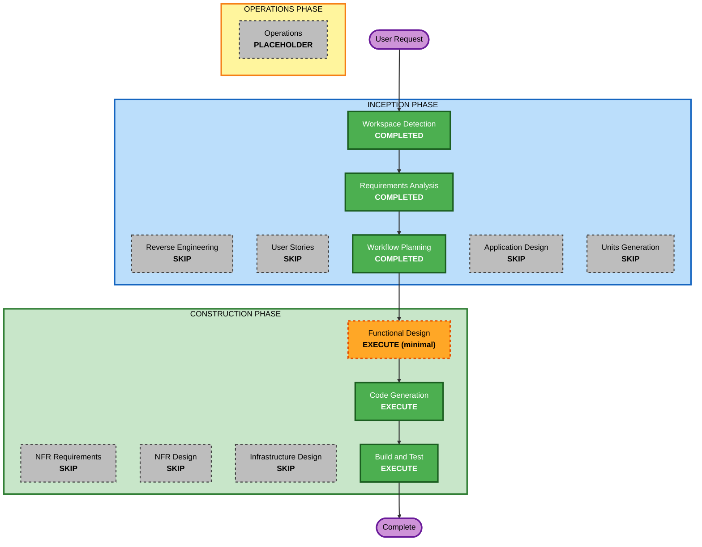

# Execution Plan

## Detailed Analysis Summary

### Change Impact Assessment
- **User-facing changes**: Yes - 全新桌面游戏 UI（PySide6 + QFluentWidgets）
- **Structural changes**: No - 单一桌面应用，逻辑/UI 两层分离
- **Data model changes**: No - 无持久化数据（不保存最佳成绩）
- **API changes**: No - 无外部接口
- **NFR impact**: Low - 仅高级难度级联展开性能（<100ms）与逻辑层可测试性

### Risk Assessment
- **Risk Level**: Low
- **Rollback Complexity**: Easy
- **Testing Complexity**: Simple（纯逻辑可单测，UI 手动验证）

## Workflow Visualization



### Text Alternative

```
INCEPTION:  Workspace Detection [COMPLETED] -> Requirements Analysis [COMPLETED]
            -> Workflow Planning [COMPLETED]
            (Reverse Engineering / User Stories / Application Design / Units Generation: SKIP)
CONSTRUCTION: Functional Design [EXECUTE, minimal] -> Code Generation [EXECUTE]
            -> Build and Test [EXECUTE]
            (NFR Requirements / NFR Design / Infrastructure Design: SKIP)
OPERATIONS:   Operations [PLACEHOLDER]
```

## Phases to Execute

### 🔵 INCEPTION PHASE
- [x] Workspace Detection (COMPLETED)
- [x] Requirements Analysis (COMPLETED)
- [x] Workflow Planning (COMPLETED)
- [ ] Application Design - SKIP
  - **Rationale**: 单一桌面应用，组件边界清晰（逻辑层 + UI 层已在需求中确定），无需独立的服务层设计
- [ ] Units Generation - SKIP
  - **Rationale**: 单一单元工作量（单包应用），无需拆分

### 🟢 CONSTRUCTION PHASE
- [ ] Functional Design - EXECUTE（minimal depth）
  - **Rationale**: 需明确定义领域模型（Cell/Board/GameState）、业务规则（首点安全布雷、级联展开、chord、胜负判定）及可测试属性（PBT-01，作为 PBT 测试输入）
- [ ] NFR Requirements - SKIP
  - **Rationale**: 技术栈已在需求文档中确定（含 Hypothesis，满足 PBT-09）；无其他显著 NFR
- [ ] NFR Design - SKIP
  - **Rationale**: 无 NFR 模式需要设计
- [ ] Infrastructure Design - SKIP
  - **Rationale**: 本地桌面应用，无基础设施
- [ ] Code Generation - EXECUTE (ALWAYS)
  - **Rationale**: 实现规划与代码生成
- [ ] Build and Test - EXECUTE (ALWAYS)
  - **Rationale**: 构建、测试与验证

### 🟡 OPERATIONS PHASE
- [ ] Operations - PLACEHOLDER

## Estimated Timeline
- **Total Stages**: 6（3 已完成 + 3 待执行）
- **Estimated Duration**: 单次会话内完成

## Success Criteria
- **Primary Goal**: 可运行的经典扫雷桌面游戏，复刻 Windows 经典玩法
- **Key Deliverables**: 源码（`minesweeper/`）、pytest + Hypothesis 测试、PyInstaller exe
- **Quality Gates**: 全部测试通过；高级难度展开性能 <100ms；exe 可双击运行
