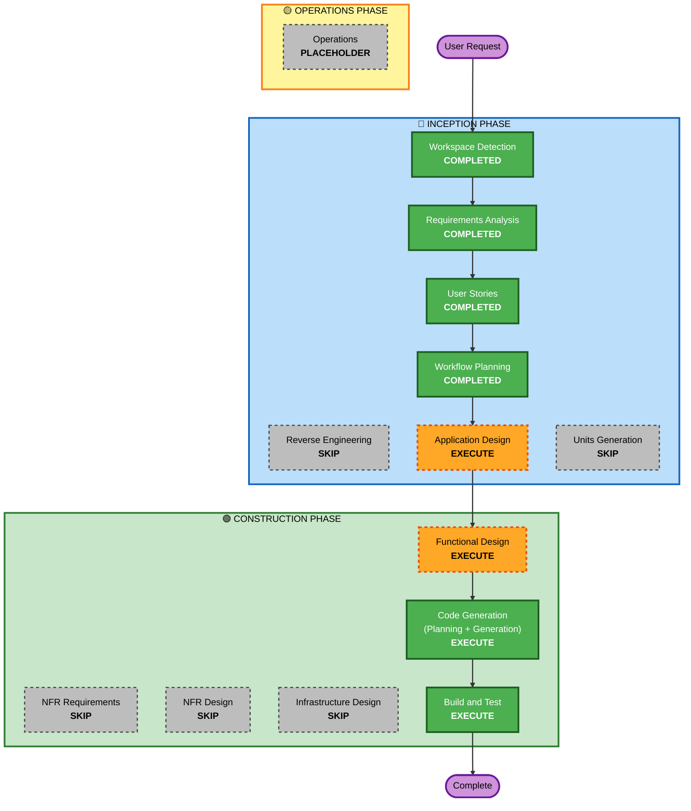

# Execution Plan - 数独 Web 游戏

## Detailed Analysis Summary

### Change Impact Assessment
- **User-facing changes**: Yes — 全新的游戏界面与交互（棋盘、输入、反馈）
- **Structural changes**: Yes — 新建单前端应用架构（Phaser 场景 + 游戏状态 + 算法模块）
- **Data model changes**: Yes — 客户端数据模型（棋盘状态、候选数、操作历史、localStorage 存档结构）
- **API changes**: No — 纯前端，无后端接口
- **NFR impact**: Yes — 性能（60 FPS、生成 <1s、响应 <100ms）与本地持久化可靠性

### Risk Assessment
- **Risk Level**: Low — 全新独立项目，无现有系统影响，易于回滚
- **Rollback Complexity**: Easy — 绿地项目，无生产依赖
- **Testing Complexity**: Moderate — 数独生成器（唯一解保证）与游戏规则逻辑需要充分单测

## Workflow Visualization



### Text Alternative

```text
INCEPTION:    Workspace Detection (COMPLETED) -> Requirements Analysis (COMPLETED)
              -> User Stories (COMPLETED) -> Workflow Planning (COMPLETED)
              -> Application Design (EXECUTE) -> [Units Generation SKIP]
CONSTRUCTION: Functional Design (EXECUTE) -> [NFR Requirements/Design SKIP]
              -> [Infrastructure Design SKIP] -> Code Generation (EXECUTE)
              -> Build and Test (EXECUTE)
OPERATIONS:   Operations (PLACEHOLDER)
```

## Phases to Execute

### 🔵 INCEPTION PHASE
- [x] Workspace Detection (COMPLETED)
- [x] Reverse Engineering (SKIPPED - greenfield)
- [x] Requirements Analysis (COMPLETED)
- [x] User Stories (COMPLETED)
- [x] Workflow Planning (COMPLETED)
- [ ] Application Design - EXECUTE
  - **Rationale**: 新应用需要组件识别（游戏场景、棋盘 UI、游戏状态、数独生成/求解算法、存档管理）与组件间依赖定义；以 minimal depth 执行
- [ ] Units Generation - SKIP
  - **Rationale**: 单一前端应用、规模适中，一个工作单元即可承载，无需多单元分解

### 🟢 CONSTRUCTION PHASE
- [ ] Functional Design - EXECUTE
  - **Rationale**: 存在新数据模型（棋盘状态、存档结构）与复杂业务逻辑（唯一解谜题生成器、数独规则校验、撤销/重做栈）
- [ ] NFR Requirements - SKIP
  - **Rationale**: 技术栈已在需求分析中确定（Phaser 3 + TypeScript + Vite）；性能与持久化 NFR 已在 requirements.md 记录，无新增评估需求
- [ ] NFR Design - SKIP
  - **Rationale**: NFR Requirements 跳过，无需 NFR 模式设计
- [ ] Infrastructure Design - SKIP
  - **Rationale**: 纯前端静态应用，无云资源、无部署架构需求
- [ ] Code Generation - EXECUTE (ALWAYS)
  - **Rationale**: 实现规划与代码生成
- [ ] Build and Test - EXECUTE (ALWAYS)
  - **Rationale**: 构建、测试与验证

### 🟡 OPERATIONS PHASE
- [ ] Operations - PLACEHOLDER
  - **Rationale**: 未来部署与监控工作流占位

## Estimated Timeline
- **Total Phases**: 剩余 4 个执行阶段（Application Design → Functional Design → Code Generation → Build and Test）
- **Estimated Duration**: 单次会话内可完成

## Success Criteria
- **Primary Goal**: 交付可玩的中文数独 Web 游戏（完整版功能），`npm run dev` 本地可运行，`npm run build` 可构建
- **Key Deliverables**: Phaser 3 + TypeScript + Vite 应用代码、单元测试、构建与测试说明文档
- **Quality Gates**: FR-1~FR-12 全部实现并通过 US-01~US-12 验收标准；谜题生成器唯一解与游戏规则逻辑有单元测试覆盖；构建无类型错误
