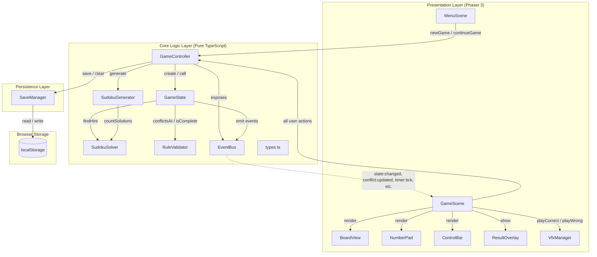
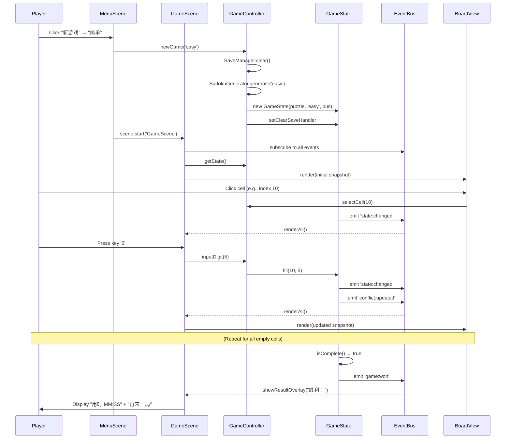

# Architecture — Sudoku Web Game

## System Overview

The system is a **single-page application (SPA)** with a layered architecture:

| Layer | Contents | Dependencies |
|-------|----------|--------------|
| **Presentation** | Phaser 3 Scenes (`MenuScene`, `GameScene`) and UI components (`BoardView`, `NumberPad`, `ControlBar`, `ResultOverlay`, `VfxManager`) | Reads GameController via registry; subscribes to EventBus for state updates |
| **Core Logic** | Pure TypeScript: `GameController`, `GameState`, `SudokuGenerator`, `SudokuSolver`, `RuleValidator`, `EventBus`, `types.ts` | Zero Phaser/UI dependencies; `SudokuGenerator` → `SudokuSolver`; `GameState` → `RuleValidator`, `SudokuSolver`, `EventBus` |
| **Persistence** | `SaveManager` (localStorage wrapper) | Accessed only by `GameController` |

**Communication**: UI-to-core is direct method calls on `GameController`. Core-to-UI is exclusively via `EventBus` events (no reverse imports).

## Architecture Diagram

**Plain-text alternative**: The Presentation Layer (MenuScene, GameScene, BoardView, NumberPad, ControlBar, ResultOverlay, VfxManager) calls GameController directly for all user actions. GameController orchestrates GameState, SudokuGenerator, and SaveManager. GameState uses RuleValidator and SudokuSolver internally. GameState emits events via EventBus, which GameScene subscribes to for UI re-rendering. SaveManager reads/writes localStorage.

## Component Descriptions

### Core Logic Layer

| Component | Type | Purpose | Responsibilities | Dependencies |
|-----------|------|---------|-----------------|--------------|
| **GameController** | Orchestrator (class) | Single entry point from UI to core logic | newGame, continueGame, inputDigit, erase, undo, redo, hint, reset, toggleNoteMode, selectCell, tick, auto-save (every 5s + after each action) | GameState, SudokuGenerator, SaveManager, EventBus |
| **GameState** | Domain model (class) | Single-game state machine and business rule enforcer | Board/notes/selection/status management; fill/erase/toggleNote/undo/redo/applyHint/reset/tick; win/loss detection; serialization to/from GameSave | RuleValidator, SudokuSolver (for hints), EventBus |
| **SudokuGenerator** | Utility (static class) | Puzzle generation | Generate full random solution; symmetric cell removal; uniqueness verification via countSolutions | SudokuSolver |
| **SudokuSolver** | Utility (static class) | Sudoku solving algorithms | solve (MRV backtracking), countSolutions (with limit), findHint (first empty cell) | None |
| **RuleValidator** | Utility (static class) | Stateless rule checks | conflictsAt (row/col/box conflict detection), isCorrect (value vs solution), isComplete (full board match) | None |
| **EventBus** | Infrastructure (class) | Publish/subscribe communication channel | on, off, emit for 7 domain events | None |
| **types.ts** | Module | Shared type definitions | Difficulty, CellIndex, CellValue, GameStatus, Puzzle, Move, MoveType, GameSave, EVENTS constants, MAX_MISTAKES, SAVE_VERSION | None |

### Persistence Layer

| Component | Type | Purpose | Responsibilities | Dependencies |
|-----------|------|---------|-----------------|--------------|
| **SaveManager** | Service (class) | localStorage persistence boundary | save (JSON serialize + setItem), load (getItem + JSON parse + structural validation; returns null on any failure), hasSave, clear | Web Storage API only |

### Presentation Layer

| Component | Type | Purpose | Responsibilities | Dependencies |
|-----------|------|---------|-----------------|--------------|
| **main.ts** | Entry point | Application bootstrap | Creates Phaser.Game (540x700, AUTO renderer, #fafafa bg), instantiates GameController, stores it in Phaser registry, registers MenuScene + GameScene | Phaser, GameController, MenuScene, GameScene |
| **MenuScene** | Phaser Scene | Main menu | Title display, "继续上次游戏" button (if save exists), "新游戏" with 4 difficulty buttons; handles save load failure gracefully (restarts scene) | GameController (via registry), SaveManager (direct instantiation) |
| **GameScene** | Phaser Scene | Gameplay orchestrator | Assembles BoardView/NumberPad/ControlBar/ResultOverlay/VfxManager; subscribes to all EventBus events; routes keyboard (1-9, Delete, Backspace, N, Z, Y, H) and button input to GameController; drives 1s timer; handles win/lost overlays; cleanup on scene shutdown | GameController (via registry), EventBus, all UI components, RuleValidator (for conflict computation in renderAll) |
| **BoardView** | UI component (class) | 9x9 grid rendering | Draws grid lines (thin/thick for 3x3 boxes); renders cell values with color/style per state (given/black-bold, user/blue, wrong/red); renders notes as 3x3 sub-grid text; multi-layer cell highlighting (conflict > selected > same-value > peers); click handler | Phaser Graphics and Text objects |
| **NumberPad** | UI component (class) | Digit input buttons | Horizontal row of 10 buttons (1-9 + "清除"); visual state for note mode (blue fill + "笔记模式" label); digits grayed out when all 9 placed correctly; click callbacks to GameScene | Phaser Rectangle and Text objects |
| **ControlBar** | UI component (class) | Game controls and status | Timer display (MM:SS), mistake counter ("错误 x/3"), difficulty label; 6 action buttons (撤销/重做/提示/笔记/重开/新游戏) with enabled/disabled states; note button color toggle | Phaser Rectangle and Text objects |
| **ResultOverlay** | UI component (class) | Win/loss overlay | Semi-transparent overlay with panel, title, subtitle, and action button; dynamically configured via show() | Phaser Container, Rectangle, Text |
| **VfxManager** | UI component (class) | Combo visual effects | Streak counting (4 tiers); correct-fill effects (burst, ring, flash); row/col/box completion sweep; ambient effects (border pulse, rising particles, edge particles, confetti); wrong-fill effects (shatter, camera shake, full reset) | Phaser Particles, Graphics, Tweens, Camera |

## Key Workflow: Start New Game → Input Digit → Win

**Plain-text alternative**: Player clicks "新游戏" then difficulty on MenuScene. Menu calls GameController.newGame() which clears old save, generates a puzzle, and creates GameState. GameScene starts and subscribes to EventBus events. Player clicks a cell → selectCell(index) → state:changed event → BoardView re-render. Player inputs a digit → inputDigit → fill → state:changed + conflict:updated events → re-render. When all cells match solution, game:won emitted → ResultOverlay shown with time.

## Integration Points

| Integration | Type | Protocol | Notes |
|-------------|------|----------|-------|
| **localStorage** | Browser Web Storage API | `getItem`/`setItem`/`removeItem`, JSON serialization | Single key `sudoku-game-save`. All read/write wrapped in try/catch. Load validates version, structure, and value ranges; any failure returns null. |
| **Phaser Registry** | In-memory key-value store | `game.registry.set`/`get` | Used ONLY to share the GameController singleton from main.ts to MenuScene and GameScene. |

**No external APIs, databases, or network calls.** The application is fully self-contained.

## Infrastructure Components

**None.** The application is a static SPA deployed as flat files from `dist/`. No backend, no CDN dependency (Phaser is bundled via npm).

### Vite Dev Server Configuration

- Host: `127.0.0.1`
- Port: `5173`
- Output directory: `dist/`
