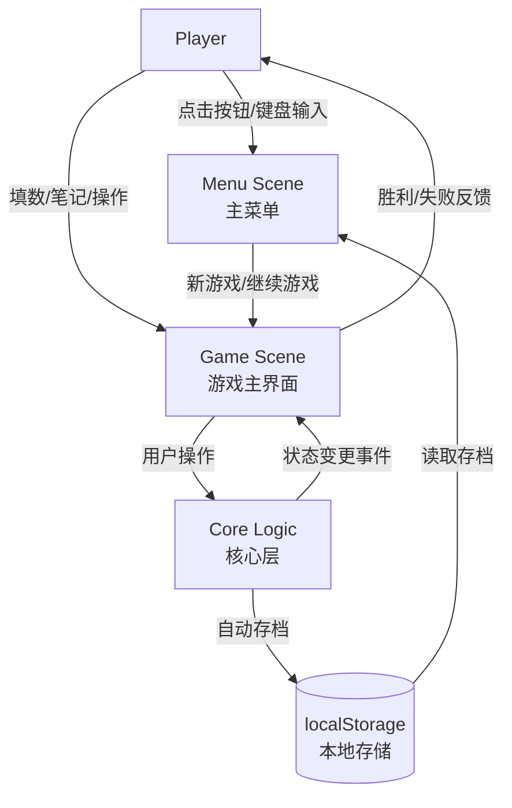

# Business Overview — Sudoku Web Game

## What the System Does

The application is a **frontend-only Chinese-language Sudoku web game** built with Phaser 3 + TypeScript + Vite. It provides:

- **Puzzle Generation**: Generates uniquely solvable Sudoku puzzles across four difficulty levels (简单/中等/困难/专家)
- **Play**: Fill digits 1-9 into a 9x9 grid via mouse click or keyboard; real-time conflict detection with visual highlighting
- **Candidate Notes**: Toggle "note mode" (笔记模式) to annotate cells with candidate numbers in a 3x3 sub-grid layout; auto-clears peer notes on correct fills
- **Undo/Redo**: Full undo/redo history across fill, erase, note, and hint operations with complete snapshot restoration (values, notes, peer-note clears, mistakes)
- **Timer**: Elapsed-time display (MM:SS) pausing when the browser tab is hidden (`visibilitychange`)
- **Auto-Save**: Game state automatically persisted to `localStorage` every 5 seconds and after every valid action; lost/won/reset clears save
- **Hint**: Fills the first empty cell with its solution value and locks it as a given (undo restores the lock)
- **Error Limit**: Three mistakes allowed; the fourth mistake locks the board and triggers a loss
- **Combo VFX**: Streak-based visual effects system (4 tiers: 1-2/3-5/6-8/9+ consecutive correct fills) with particle bursts, rings, cell flashes, row/column/box sweep effects, ambient border pulsing, upward particles, confetti, and edge particles; wrong fills trigger shatter particles and camera shake, resetting the streak to zero

## Business Context Diagram

**Plain-text alternative**: Player interacts with Menu Scene and Game Scene. Menu Scene reads from localStorage and starts new or continued games in Game Scene. Game Scene forwards user actions to Core Logic, which emits state-change events back to the UI and auto-saves to localStorage.

## Business Transactions

| # | Transaction | Description |
|---|-------------|-------------|
| 1 | **Start New Game** | Player selects a difficulty level (简单/中等/困难/专家); a new puzzle is generated; the game scene activates. Any existing save is cleared. |
| 2 | **Resume Saved Game** | Player clicks "继续上次游戏" on the menu; saved state is loaded and restored, including board, notes, history, mistakes, and elapsed time. Invalid/corrupted saves silently degrade to new game. |
| 3 | **Input Digit** | Player fills a cell (keyboard 1-9 or number pad button) in fill mode. Correct fills auto-clear peer notes; wrong fills increment mistakes. Triggers combo VFX. |
| 4 | **Toggle Note Mode** | Player switches to/from note mode (N key or "笔记" button). In note mode, digit input toggles candidate annotations on empty cells instead of filling values. |
| 5 | **Erase Cell** | Player clears a user-filled cell (Delete/Backspace key or "清除" button). Note annotations on that cell are also cleared. |
| 6 | **Undo** | Reverses the last move (fill/erase/note/hint), restoring value, notes, peer-note clears, and mistake count. |
| 7 | **Redo** | Re-applies the last undone move. Cleared if any new operation is performed. |
| 8 | **Request Hint** | Fills the first empty cell with its correct solution value and marks it as given (locked). Does not count as a mistake. |
| 9 | **Reset Game** | Restores the current puzzle to its initial state (all givens untouched, all user fills erased, notes cleared, mistakes and timer zeroed, history cleared). Clears any save. |
| 10 | **Complete Puzzle** | All 81 cells filled and match the solution exactly. Timer stops, win overlay shows play time, save is cleared. |
| 11 | **Fail (Max Mistakes)** | Three wrong fills accumulate. Board locks — all fill/erase/note/undo/redo operations rejected. Loss overlay shown, save cleared. |
| 12 | **Trigger Combo VFX** | Each correct fill increments a streak counter. VfxManager plays tiered particle effects (burst, ring, flash), row/col/box sweep on unit completion, and ambient effects (border pulse, rising particles, edge particles, confetti) at higher tiers. Wrong fills reset streak and play shatter + screen shake. |

## Business Dictionary

| Term (EN) | Term (ZH) | Definition |
|-----------|-----------|------------|
| **Puzzle** (谜题) | A set of givens (initial layout with some cells filled) and a unique complete solution. Composed of 81 `CellValue`s each. |
| **Givens** (预填数字) | The initially placed digits that form the puzzle. Cannot be modified, erased, or annotated. Hint-applied cells also become givens. |
| **Cell** (格子) | One of the 81 positions on the grid, indexed 0-80 row-major. Has a value (0=empty, 1-9), a given flag, and optional candidate notes. |
| **Board** (棋盘) | The 81-cell working state during a game (includes givens, user fills, and empty cells). |
| **Solution** (解) | The uniquely correct, fully filled 81-cell answer for the puzzle. Stored alongside givens in the Puzzle object. |
| **Notes** (候选数/笔记) | Per-cell sets of candidate digits (1-9) that the player can toggle while in note mode. Only valid on empty cells; auto-cleared on correct fills of the same digit in the same row/col/box. |
| **Conflict** (冲突) | Two or more cells in the same row, column, or 3x3 box containing the same non-zero value. Visually highlighted in red. |
| **Move** (操作记录) | A snapshot record of a single action (fill/erase/note/hint) including old/new values, notes, cleared peer notes, and mistake delta. Stored in undo/redo stacks. |
| **Streak** (连击) | Consecutive correct fill count (resets to 0 on any wrong fill). Used by VfxManager to determine VFX tier. |
| **Tier** (档位/特效档位) | Streak ranges mapping to VFX intensity: Tier 0 (1-2), Tier 1 (3-5), Tier 2 (6-8), Tier 3 (9+). Each tier adds more particle count, range, and ambient effects. |
| **Difficulty** (难度) | One of four levels determining the givens count range. No effect on solution complexity or solving strategy — only the number of pre-filled cells changes. |
| **简单 (Easy)** | 40-45 givens |
| **中等 (Medium)** | 32-39 givens |
| **困难 (Hard)** | 26-31 givens |
| **专家 (Expert)** | 22-25 givens |

## Component-Level Business Descriptions

| Component | Business Role |
|-----------|---------------|
| **GameController** | Orchestrates the full game lifecycle: new game creation, saved game resumption, input routing (fill/erase/note/undo/redo/hint/reset), timer tick forwarding, and auto-save triggering. The single entry point from UI to core logic. |
| **GameState** | Maintains the current game's entire mutable state: board, notes, selection, note mode flag, mistakes, status (playing/won/lost), elapsed time, and undo/redo stacks. Enforces all business rules (given-cell immutability, 3-mistake loss, win detection, etc.). Serializes to/from `GameSave`. |
| **SudokuGenerator** | Creates a valid Sudoku puzzle: generates a full random solution via backtracking, then symmetrically removes cells (paired removal of i and 80-i) while verifying the puzzle retains exactly one solution. |
| **SudokuSolver** | Backtracking solver with MRV (Minimum Remaining Values) heuristic. Provides solve, countSolutions (with limit for early termination), and findHint (locates the first empty cell). |
| **RuleValidator** | Stateless rule checks: conflict detection per cell (row/col/box peers with same value), correctness check (value vs. solution), and completion check (all cells match solution). |
| **SaveManager** | Persistence boundary: saves/loads/clears game state to/from `localStorage` key `sudoku-game-save`. Performs structural validation (version, board length, note structure, move integrity, mistake range, status enum) on load; any failure returns null (graceful degradation). |
| **EventBus** | In-memory publish/subscribe bus connecting core logic to the UI layer. Events: `state:changed`, `conflict:updated`, `mistakes:changed`, `timer:tick`, `note-mode:changed`, `game:won`, `game:lost`. |
| **MenuScene** | Phaser scene: displays title, "继续上次游戏" (if save exists), and "新游戏" with four difficulty buttons. On difficulty selection, calls GameController.newGame and transitions to GameScene. |
| **GameScene** | Phaser scene: assembles all UI components (BoardView, NumberPad, ControlBar, ResultOverlay, VfxManager), subscribes to all EventBus events for re-render, routes keyboard and button input to GameController, and drives the 1-second timer. |
| **BoardView** | Renders the 9x9 Sudoku grid: thick borders for 3x3 boxes, cell values (given=bold-black, user=blue, wrong=red), 3x3 sub-grid note annotations, and multi-layer cell highlighting (conflict>selected>same-value>peers). |
| **NumberPad** | Horizontal row of 10 buttons (1-9 + "清除" erase button). Digit buttons gray out when all 9 occurrences of that digit are correctly placed. Note mode visually alters all buttons (blue fill + "笔记模式" label). |
| **ControlBar** | Top bar showing timer (MM:SS), mistake counter ("错误 x/3"), difficulty label, and six action buttons (撤销/重做/提示/笔记/重开/新游戏). Undo/redo disabled when stacks empty. Note button highlighted in note mode. |
| **ResultOverlay** | Semi-transparent overlay panel shown on win (displays play time) or loss (error limit message), with a button to return to the menu. |
| **VfxManager** | Manages combo streak counting and all visual effects: correct-fill particle burst + ring + cell flash, row/col/box completion sweep, ambient border pulse (tier 1+), rising particles (tier 2+), edge particles + confetti (tier 3+), and wrong-fill shatter particles + camera shake with full reset. |
