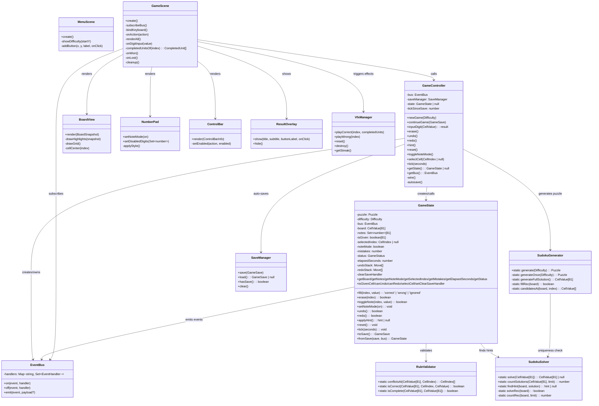

# Code Structure — Sudoku Web Game

## Build System

| Item | Detail |
|------|--------|
| Package manager | npm |
| Build tool | Vite 5 |
| TypeScript compiler | tsc (via Vite; `noEmit: true` — Vite handles transpilation) |
| Test runner | Vitest 2 |
| Dev server | `vite` (port 5173, host 127.0.0.1) |
| Production build | `vite build` (output: `dist/`) |

### Key Configurations

**tsconfig.json**:
- Target: `ES2020`
- Module: `ESNext`, resolution: `bundler`
- Strict mode: `true` (with `noUnusedLocals`, `noUnusedParameters`, `noFallthroughCasesInSwitch`, `noImplicitReturns`)
- `isolatedModules: true`, `forceConsistentCasingInFileNames: true`, `skipLibCheck: true`
- `noEmit: true` (Vite handles output)

**vite.config.ts**:
- Dev server host: `127.0.0.1`, port: `5173`
- Build output: `dist/`

**package.json scripts**:
- `dev`: `vite` (development server)
- `build`: `vite build` (production build)
- `test`: `vitest run` (unit tests)

## Key Modules — Class/Module Diagram

**Plain-text alternative**: GameController owns EventBus, creates GameState, calls SudokuGenerator for puzzles, and SaveManager for auto-save. GameState uses RuleValidator for validation and SudokuSolver for hints, and emits events via EventBus. SudokuGenerator calls SudokuSolver for uniqueness checks. GameScene calls GameController for all actions, subscribes to EventBus for re-renders, and delegates rendering to BoardView, NumberPad, ControlBar, ResultOverlay, and VfxManager.

## Existing Files Inventory

### Source Files (src/)

**Entry Point:**
- `src/main.ts` — Phaser.Game bootstrap: creates GameController, configures Phaser (540x700, AUTO renderer), registers MenuScene + GameScene, stores controller in registry

**Core Logic (src/core/):**
- `src/core/types.ts` — All shared type aliases (`Difficulty`, `CellIndex`, `CellValue`, `GameStatus`), interfaces (`Puzzle`, `Move`, `GameSave`), constants (`EVENTS`, `MAX_MISTAKES=3`, `SAVE_VERSION=1`), and `MoveType`
- `src/core/event-bus.ts` — Publish/subscribe event bus (`on`, `off`, `emit`) using Map<string, Set<EventHandler>>; core-to-UI communication channel
- `src/core/game-state.ts` — Game state machine: 81-cell board, notes (Set<number>[81]), selection, mistakes (0-3), status (playing/won/lost), undo/redo stacks, timer; implements fill/erase/toggleNote/undo/redo/applyHint/reset/tick; serialization via toSave/fromSave
- `src/core/game-controller.ts` — Orchestration service: newGame (generate + clear old save), continueGame (restore from save), inputDigit (routes fill vs. note based on noteMode), erase/undo/redo/hint/reset forwarding, auto-save (every 5s + after each action)
- `shared/sudoku-generator.ts`（v2.2 迁移） — Puzzle generator: full random solution via backtracking with shuffled candidates; symmetric cell removal (i paired with 80-i); uniqueness verified via countSolutions(limit=2); 4 difficulty levels (easy 40-45, medium 32-39, hard 26-31, expert 22-25 givens)
- `shared/sudoku-solver.ts`（v2.2 迁移） — MRV backtracking solver: solve (returns solution or null), countSolutions (with early-termination limit), findHint (first empty cell's solution value)
- `shared/rule-validator.ts`（v2.2 迁移） — Stateless validation: conflictsAt (returns peer indices with same value in row/col/box), isCorrect (value equals solution), isComplete (all 81 cells match solution)

**Persistence (src/persistence/):**
- `src/persistence/save-manager.ts` — localStorage wrapper: save (JSON serialize), load (parse + structural validation of version, board length, notes structure, move fields, mistakes range, status/difficulty enums; returns null on failure), hasSave, clear; key: `sudoku-game-save`

**Scenes (src/scenes/):**
- `src/scenes/menu-scene.ts` — MenuScene: title ("数独"), "继续上次游戏" button (shown if save exists; load failure → scene restart), "新游戏" button → shows 4 difficulty buttons (简单/中等/困难/专家); each creates new game and transitions to GameScene
- `src/scenes/game-scene.ts` — GameScene: assembles all UI components, subscribes to 7 EventBus events (state:changed, conflict:updated, mistakes:changed, timer:tick, note-mode:changed, game:won, game:lost), binds keyboard (1-9, Delete/Backspace, N/Z/Y/H), drives 1s timer, handles win/lost overlays, cleanup on shutdown

**UI Components (src/ui/):**
- `src/ui/board-view.ts` — 9x9 BoardView: 468px grid (52px cells), thick box borders (every 3rd line), value rendering (given/black-bold, user/blue, wrong/red), 3x3 sub-grid notes, 4-layer cell highlighting (conflict > selected > same-value > peers), click-to-select via Phaser zone
- `src/ui/number-pad.ts` — Horizontal NumberPad: 10 buttons (1-9 + "清除"), note mode visual toggle (blue fill + "笔记模式" label), digit graying when all 9 instances correctly placed
- `src/ui/control-bar.ts` — ControlBar: timer (MM:SS), mistakes ("错误 x/3"), difficulty label, 6 buttons (撤销/重做/提示/笔记/重开/新游戏) with enable/disable; note button highlights in note mode
- `src/ui/result-overlay.ts` — ResultOverlay: semi-transparent background + white panel with title/subtitle/button; shown on win ("胜利！" + time) or loss ("失败" + error limit)
- `src/ui/vfx-manager.ts` — VfxManager: 4-tier combo VFX system (tier 0: 1-2 streak, tier 1: 3-5, tier 2: 6-8, tier 3: 9+); correct: burst/ring/flash + unit sweep; wrong: shatter + camera shake + reset; ambient: border pulse, rising particles, edge particles, confetti

### Test Files (tests/)

- `tests/sudoku-solver.test.ts` — 9 test cases: solve empty grid, solve known puzzle, unsolvable returns null, countSolutions limit/short-circuit/unique/unsolvable, findHint
- `tests/sudoku-generator.test.ts` — 10 test cases: uniqueness across 4 difficulties (parametrized), given-count ranges across 4 difficulties (parametrized × 5 iterations), solution consistency, symmetric digging (i pairs with 80-i across 3 rounds)
- `tests/rule-validator.test.ts` — 8 test cases: row/col/box conflict detection, empty cell no conflicts, self-exclusion, different values no conflict, isCorrect, isComplete
- `tests/game-state.test.ts` — 24 test cases: fill correct/wrong/ignored, conflict payload, notes toggle, peer note auto-clear, undo/redo snapshot (values + notes + mistakes), redo stack clearing on new operation, empty history no-op, 3-mistake lock + game:lost, win detection + timer stop, erase user values only, hint apply/lock/undo unlock/null when full, reset with clear handler, clear-save on win/lost, tick accumulation/stop, selection, toSave/fromSave round-trip (including lost status)
- `tests/save-manager.test.ts` — 9 test cases: valid save round-trip, no save returns null, corrupted JSON → null, version mismatch → null, invalid board structure → null, missing fields → null, mistakes out of range → null, clear removes save, GameState.toSave round-trip

## Design Patterns

| Pattern | Usage |
|---------|-------|
| **EventBus (Observer/Pub-Sub)** | `EventBus` decouples core logic from UI. Core emits events; UI subscribes. Core never imports Phaser modules. |
| **Controller (Mediator)** | `GameController` mediates between all core modules and persistence. UI calls only GameController; GameController coordinates GameState, SudokuGenerator, and SaveManager. |
| **State Machine** | `GameState.status` transitions: `playing` → `won` (full correct board) or `lost` (3 mistakes). Won/lost disables all state-modifying operations. Reset returns to initial `playing` with the same puzzle. |
| **Command/Memento** | `Move` objects capture full snapshots (prev/next values, notes, cleared peer notes, mistake delta) for undo/redo. Each operation pushes a `Move` to the undo stack; undo pops, applies reverse, and pushes to redo stack. New operations clear redo stack. |
| **Separation of Concerns** | Pure TypeScript core (`src/core/`) has zero Phaser/dependency imports. All UI rendering is in `src/scenes/` and `src/ui/`. Core is fully unit-testable without browser/Phaser. |
| **Static Utility Classes** | `SudokuSolver`, `SudokuGenerator`, and `RuleValidator` have no instance state. All methods are static. |
| **Singleton via Registry** | `GameController` is instantiated once in `main.ts` and shared via Phaser's `registry.set('controller', controller)`. |

## Critical Dependencies

| Package | Version | Purpose |
|---------|---------|---------|
| phaser | ^3.85.0 | Game framework: canvas rendering, scenes, input, tweens, particles |
| typescript | ^5.5.4 | Type checking and transpilation (via Vite) |
| vite | ^5.4.8 | Dev server + production bundler |
| vitest | ^2.1.8 | Unit test runner and assertion library |
