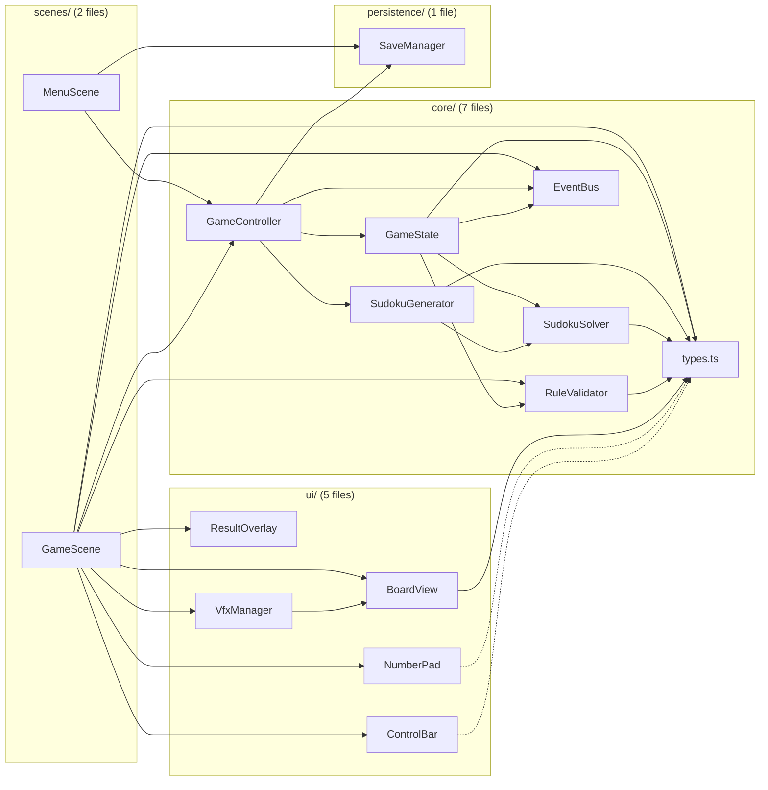

# Dependencies — Sudoku Web Game

## Internal Dependency Diagram



**Plain-text alternative**: Dependency flow is strictly downwards: UI components (BoardView, NumberPad, ControlBar, ResultOverlay, VfxManager) are assembled and called by GameScene. GameScene and MenuScene depend on GameController and EventBus. GameController depends on GameState, SudokuGenerator, EventBus, and SaveManager (only controller touches persistence). GameState depends on RuleValidator, SudokuSolver, and EventBus. SudokuGenerator depends on SudokuSolver for uniqueness checks. All modules depend on types.ts for shared types and constants. VfxManager imports BoardView constants (BOARD_SIZE, CELL_SIZE). GameScene directly imports RuleValidator and types.

## Dependency Direction

```
scenes/ui → GameController → core/ → persistence/
    ^                              ^
    └── EventBus (events) ────────┘
```

**No circular dependencies exist.** The dependency graph is acyclic. Core modules never import from scenes, ui, or persistence. UI components never import from core modules directly (they receive callbacks and snapshot data). The only exception is `GameScene` which directly imports `RuleValidator` and `types.ts` for computing board rendering state, and `VfxManager` which imports `BoardView` constants.

## External Dependencies

### Runtime Dependencies

| Package | Version | Purpose | License |
|---------|---------|---------|---------|
| phaser | ^3.85.0 | 2D game framework: Canvas/WebGL rendering, scene graph, input system, tweens, particle effects, camera | MIT |

### Dev Dependencies

| Package | Version | Purpose | License |
|---------|---------|---------|---------|
| typescript | ^5.5.4 | TypeScript language/compiler for type checking | Apache-2.0 |
| vite | ^5.4.8 | Frontend build tool: dev server, HMR, production bundler | MIT |
| vitest | ^2.1.8 | Unit test framework (Vite-native) | MIT |

### Peer / Transitive Dependencies

All other packages in `node_modules/` are transitive dependencies of the four listed above. Notable transitive dependencies include:
- Phaser's internal event emitter and math utilities
- Vite's esbuild, Rollup, and PostCSS internals
- Vitest's chai assertion library and tinybench

None of these are directly imported by application code.

## Browser API Dependencies

| API | Usage |
|-----|-------|
| `localStorage.getItem/setItem/removeItem` | Game save persistence (key: `sudoku-game-save`) |
| `JSON.stringify/parse` | Game state serialization for localStorage |
| `document.hidden` + `visibilitychange` event | Timer pause when tab is hidden |
| `Canvas` / `WebGL` (via Phaser) | Rendering |
| `requestAnimationFrame` (via Phaser) | Game loop |
