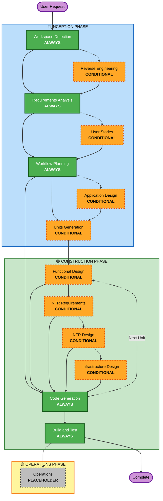

# AI-DLC 自适应工作流概览

**目的**：供 AI 模型和开发人员了解完整工作流结构的技术参考。

**注意**：welcome-message.md（用户欢迎消息）和 README.md（文档）中存在类似内容。这种重复是**有意的**——每个文件服务于不同的目的：
- **本文件**：带 Mermaid 图表的详细技术参考，供 AI 模型加载上下文
- **welcome-message.md**：带 ASCII 图表的面向用户的欢迎消息
- **README.md**：面向人类的仓库文档

## 三阶段生命周期：
• **INCEPTION 阶段**：规划与架构（工作区检测 + 条件子阶段 + 工作流规划）
• **CONSTRUCTION 阶段**：设计、实施、构建与测试（按单元设计 + 代码生成 + 构建与测试）
• **OPERATIONS 阶段**：未来部署和监控工作流的占位符

## 自适应工作流：
• **工作区检测**（始终）→ **逆向工程**（仅 brownfield）→ **需求分析**（始终，自适应深度）→ **条件子阶段**（按需）→ **工作流规划**（始终）→ **代码生成**（始终，按单元）→ **构建与测试**（始终）

## 工作原理：
• **AI 分析**您的请求、工作区和复杂度，以确定需要哪些子阶段
• **这些子阶段始终执行**：工作区检测、需求分析（自适应深度）、工作流规划、代码生成（按单元）、构建与测试
• **所有其他子阶段是有条件的**：逆向工程、用户故事、应用设计、工作单元生成、按单元设计子阶段（功能设计、NFR 需求、NFR 设计、基础设施设计）
• **没有固定顺序**：子阶段以对您的特定任务最有意义的顺序执行

## 您团队的角色：
• 使用带字母选项（A、B、C、D、E）的 [Answer]: 标签，在专门的问题文件中回答问题
• **选项 E 可用**：如果提供的选项不匹配，选择"其他"并描述您的自定义回答
• **作为团队协作**，在每个阶段继续前审查并批准
• 需要时**集体决定**架构方案
• **重要**：这是团队工作——每个阶段都让相关利益相关者参与

## AI-DLC 三阶段工作流：

**子阶段描述：**

**🔵 INCEPTION 阶段** - 规划与架构
- 工作区检测：分析工作区状态和项目类型（始终）
- 逆向工程：分析现有代码库（有条件执行 - 仅 Brownfield）
- 需求分析：收集并验证需求（始终 - 自适应深度）
- 用户故事：创建用户故事和用户画像（有条件执行）
- 工作流规划：创建执行计划（始终）
- 应用设计：高层组件识别和服务层设计（有条件执行）
- 工作单元生成：分解为工作单元（有条件执行）

**🟢 CONSTRUCTION 阶段** - 设计、实施、构建与测试
- 功能设计：按单元的详细业务逻辑设计（有条件执行，按单元）
- NFR 需求：确定 NFR 并选择技术栈（有条件执行，按单元）
- NFR 设计：纳入 NFR 模式和逻辑组件（有条件执行，按单元）
- 基础设施设计：映射到实际基础设施服务（有条件执行，按单元）
- 代码生成：生成代码，包含第 1 部分 - 规划、第 2 部分 - 生成（始终，按单元）
- 构建与测试：构建所有单元并执行全面测试（始终）

**🟡 OPERATIONS 阶段** - 占位符
- Operations：未来部署和监控工作流的占位符（占位符）

**关键原则：**
- 仅在子阶段能增值时执行
- 每个子阶段独立评估
- INCEPTION 聚焦于"是什么"（what）和"为什么"（why）
- CONSTRUCTION 聚焦于"如何"（how）以及"构建与测试"
- OPERATIONS 是未来扩展的占位符
- 简单变更可能跳过条件性 INCEPTION 子阶段
- 复杂变更获得完整的 INCEPTION 和 CONSTRUCTION 处理
