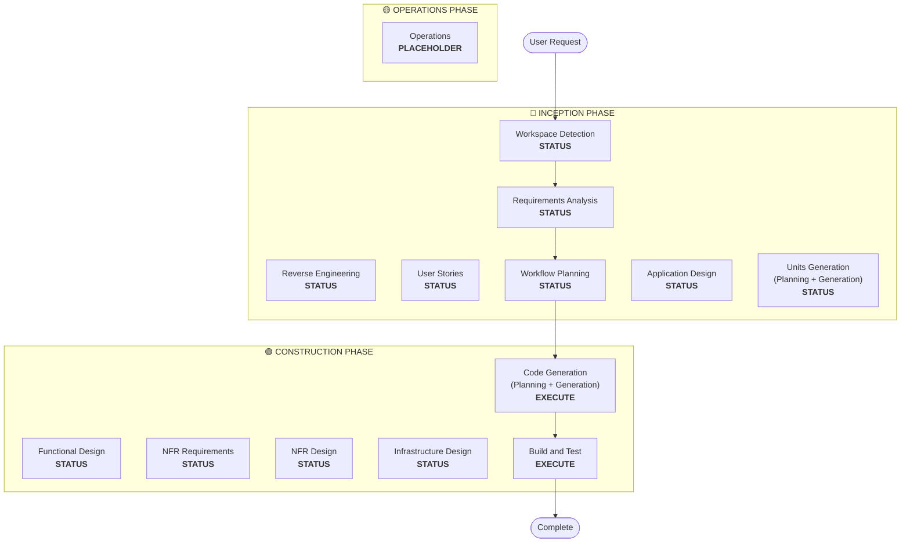

# 工作流规划（Workflow Planning）

**目的**：确定要执行的阶段并创建全面的执行计划

**始终执行**：本阶段在理解需求和范围后始终运行

## 步骤 1：加载所有先前上下文

### 1.1 加载逆向工程制品（如果是 brownfield 项目）
- architecture.md
- component-inventory.md
- technology-stack.md
- dependencies.md

### 1.2 加载需求分析
- requirements.md（包含意图分析）
- requirement-verification-questions.md（带答案）

### 1.3 加载用户故事（如果已执行）
- stories.md
- personas.md

## 步骤 2：详细的范围与影响分析

**现在我们有完整的上下文（需求 + 故事），执行详细分析：**

### 2.1 转型范围检测（仅 brownfield）

**如果是 brownfield 项目**，分析转型范围：

#### 架构转型
- **单组件变更**与**架构转型**的对比
- **基础设施变更**与**应用程序变更**的对比
- **部署模型变更**（Lambda→Container、EC2→Serverless 等）

#### 相关组件识别
对于转型，识别：
- **需要更新的基础设施代码**
- **需要变更的 CDK 堆栈**
- **API Gateway 配置**
- **负载均衡器需求**
- **需要的网络（Networking）变更**
- **监控/日志适配**

#### 跨包影响
- **需要更新的 CDK 基础设施**包
- **需要版本更新的共享模型**
- **需要端点变更的客户端库**
- **需要新测试场景的测试包**

### 2.2 变更影响评估

#### 影响领域
1. **面向用户的变更**：这会影响用户体验吗？
2. **结构性变更**：这会改变系统架构吗？
3. **数据模型变更**：这会影响数据库模式或数据结构吗？
4. **API 变更**：这会影响接口或契约吗？
5. **NFR 影响**：这会影响性能、安全性或可扩展性吗？

#### 应用层影响（如适用）
- **代码变更**：新的入口点、适配器、配置
- **依赖**：新库、框架变更
- **配置**：环境变量、配置文件
- **测试**：单元测试、集成测试

#### 基础设施层影响（如适用）
- **部署模型**：Lambda→ECS、EC2→Fargate 等
- **网络（Networking）**：VPC、安全组、负载均衡器
- **存储**：持久卷、共享存储
- **扩展（Scaling）**：自动扩展策略、容量规划

#### 运维层影响（如适用）
- **监控**：CloudWatch、自定义指标、仪表盘
- **日志**：日志聚合、结构化日志
- **告警**：告警配置、通知渠道
- **部署**：CI/CD 流水线变更、回滚策略

### 2.3 组件关系映射（仅 brownfield）

**如果是 brownfield 项目**，创建组件依赖图：

```markdown
## Component Relationships
- **Primary Component**: [Package being changed]
- **Infrastructure Components**: [CDK/Terraform packages]
- **Shared Components**: [Models, utilities, clients]
- **Dependent Components**: [Services that call this component]
- **Supporting Components**: [Monitoring, logging, deployment]
```

对于每个相关组件：
- **变更类型（Change Type）**：重大（Major）、次要（Minor）、仅配置（Configuration-only）
- **变更原因（Change Reason）**：直接依赖、部署模型、网络（networking）
- **变更优先级（Change Priority）**：关键（Critical）、重要（Important）、可选（Optional）

### 2.4 风险评估

评估风险级别：
1. **低（Low）**：孤立变更，容易回滚，充分理解
2. **中（Medium）**：多个组件，回滚中等难度，存在一些未知因素
3. **高（High）**：系统范围影响，回滚复杂，未知因素显著
4. **关键（Critical）**：生产关键，回滚困难，不确定性高

## 步骤 3：阶段确定

### 3.1 用户故事（User Stories）- 已执行还是跳过？
**已执行**：进入下一个判断
**未执行 - 在以下情况执行**：
- 有多个用户画像（personas）
- 有用户体验影响
- 需要验收标准
- 需要团队协作

**在以下情况跳过**：
- 内部重构
- 有清晰复现步骤的缺陷修复
- 技术债务削减
- 基础设施变更

### 3.2 应用程序设计（Application Design）- 在以下情况执行：
- 需要新组件或服务
- 需要定义组件方法和业务规则
- 需要服务层设计
- 需要澄清组件依赖

**在以下情况跳过**：
- 变更在现有组件边界内
- 没有新组件或方法
- 纯实施变更

### 3.3 单元生成（Units Generation）- 在以下情况执行：
- 有新数据模型或模式
- 有 API 变更或新端点
- 有复杂算法或业务逻辑
- 有状态管理变更
- 多个包需要变更
- 需要基础设施即代码（Infrastructure-as-code）更新

**在以下情况跳过**：
- 简单逻辑变更
- 仅 UI 变更
- 配置更新
- 直截了当的实施

### 3.4 NFR 实施（NFR Implementation）- 在以下情况执行：
- 有性能需求
- 有安全考虑
- 有可扩展性顾虑
- 需要监控/可观测性

**在以下情况跳过**：
- 现有 NFR 配置已足够
- 没有新的 NFR 需求
- 无 NFR 影响的简单变更

## 步骤 4：注意自适应细节

**自适应深度说明参见 [depth-levels.md](../common/depth-levels.md)**

对于将要执行的每个阶段：
- 将创建所有已定义的制品
- 制品内的细节级别随问题复杂度自适应调整
- 模型根据问题特征确定适当的细节

## 步骤 5：多模块协调分析（仅 brownfield）

**如果是带多个模块/包的 brownfield 项目**，分析依赖并确定最优更新策略：

### 5.1 分析模块依赖
- 检查构建系统依赖和依赖清单
- 识别构建时与运行时依赖
- 映射模块间的 API 契约和共享接口

### 5.2 确定更新策略
根据依赖分析，决定：
- **更新顺序**：哪些模块必须因依赖关系而先更新
- **并行化机会**：哪些模块可以同时更新
- **协调需求**：版本兼容性、API 契约、部署顺序
- **测试策略**：按模块测试与集成测试方法
- **回滚策略**：序列中途发生失败时的恢复计划

### 5.3 记录协调计划
```markdown
## Module Update Strategy
- **Update Approach**: [Sequential/Parallel/Hybrid]
- **Critical Path**: [Modules that block other updates]
- **Coordination Points**: [Shared APIs, infrastructure, data contracts]
- **Testing Checkpoints**: [When to validate integration]
```

为每个受影响的模块识别：
- **更新优先级**：必须优先更新与可以稍后更新
- **依赖约束**：它依赖什么，什么依赖它
- **变更范围**：重大（Major，破坏性）、次要（Minor，兼容）、补丁（Patch，修复）

## 步骤 6：生成工作流可视化

创建展示以下内容的 Mermaid 流程图：
- 所有阶段按顺序排列
- 每个条件阶段的执行（EXECUTE）或跳过（SKIP）决策
- 每个阶段状态的适当样式

**样式规则**（在流程图后添加）：
```
style WD fill:#4CAF50,stroke:#1B5E20,stroke-width:3px,color:#fff
style CG fill:#4CAF50,stroke:#1B5E20,stroke-width:3px,color:#fff
style BT fill:#4CAF50,stroke:#1B5E20,stroke-width:3px,color:#fff
style US fill:#BDBDBD,stroke:#424242,stroke-width:2px,stroke-dasharray: 5 5,color:#000
style Start fill:#CE93D8,stroke:#6A1B9A,stroke-width:3px,color:#000
style End fill:#CE93D8,stroke:#6A1B9A,stroke-width:3px,color:#000

linkStyle default stroke:#333,stroke-width:2px
```

**样式指南**：
- 已完成/始终执行：`fill:#4CAF50,stroke:#1B5E20,stroke-width:3px,color:#fff`（Material 绿色，白色文字）
- 条件执行（EXECUTE）：`fill:#FFA726,stroke:#E65100,stroke-width:3px,stroke-dasharray: 5 5,color:#000`（Material 橙色，黑色文字）
- 条件跳过（SKIP）：`fill:#BDBDBD,stroke:#424242,stroke-width:2px,stroke-dasharray: 5 5,color:#000`（Material 灰色，黑色文字）
- 开始/结束：`fill:#CE93D8,stroke:#6A1B9A,stroke-width:3px,color:#000`（Material 紫色，黑色文字）
- 阶段容器：使用更浅的 Material 颜色（INCEPTION: #BBDEFB, CONSTRUCTION: #C8E6C9, OPERATIONS: #FFF59D）

## 步骤 7：创建执行计划文档

创建 `aidlc-docs/inception/plans/execution-plan.md`：

```markdown
# Execution Plan

## Detailed Analysis Summary

### Transformation Scope (Brownfield Only)
- **Transformation Type**: [Single component/Architectural/Infrastructure]
- **Primary Changes**: [Description]
- **Related Components**: [List]

### Change Impact Assessment
- **User-facing changes**: [Yes/No - Description]
- **Structural changes**: [Yes/No - Description]
- **Data model changes**: [Yes/No - Description]
- **API changes**: [Yes/No - Description]
- **NFR impact**: [Yes/No - Description]

### Component Relationships (Brownfield Only)
[Component dependency graph]

### Risk Assessment
- **Risk Level**: [Low/Medium/High/Critical]
- **Rollback Complexity**: [Easy/Moderate/Difficult]
- **Testing Complexity**: [Simple/Moderate/Complex]

## Workflow Visualization



**注意**：将 STATUS 占位符替换为实际的阶段状态（COMPLETED/SKIP/EXECUTE）并应用适当的样式

## 要执行的阶段

### 🔵 INCEPTION PHASE
- [x] 工作区检测（Workspace Detection）(COMPLETED)
- [x] 逆向工程（Reverse Engineering）(COMPLETED/SKIPPED)
- [x] 需求分析（Requirements Analysis）(COMPLETED)
- [x] 用户故事（User Stories）(COMPLETED/SKIPPED)
- [x] 执行计划（Execution Plan）(IN PROGRESS)
- [ ] 应用程序设计（Application Design）- [EXECUTE/SKIP]
  - **理由（Rationale）**：[为什么执行或跳过]
- [ ] 单元生成（Units Generation）- [EXECUTE/SKIP]
  - **理由（Rationale）**：[为什么执行或跳过]

### 🟢 CONSTRUCTION PHASE
- [ ] 功能设计（Functional Design）- [EXECUTE/SKIP]
  - **理由（Rationale）**：[为什么执行或跳过]
- [ ] NFR 需求（NFR Requirements）- [EXECUTE/SKIP]
  - **理由（Rationale）**：[为什么执行或跳过]
- [ ] NFR 设计（NFR Design）- [EXECUTE/SKIP]
  - **理由（Rationale）**：[为什么执行或跳过]
- [ ] 基础设施设计（Infrastructure Design）- [EXECUTE/SKIP]
  - **理由（Rationale）**：[为什么执行或跳过]
- [ ] 代码生成（Code Generation）- EXECUTE (ALWAYS)
  - **理由（Rationale）**：需要实施规划和代码生成
- [ ] 构建与测试（Build and Test）- EXECUTE (ALWAYS)
  - **理由（Rationale）**：需要构建、测试和验证

### 🟡 OPERATIONS PHASE
- [ ] 运维（Operations）- PLACEHOLDER
  - **理由（Rationale）**：未来的部署和监控工作流

## 包变更顺序（仅 brownfield）
[如适用，列出带依赖关系的包更新顺序]

## 预计时间线
- **阶段总数（Total Phases）**：[数字]
- **预计持续时间（Estimated Duration）**：[时间估计]

## 成功标准
- **主要目标（Primary Goal）**：[主要目标]
- **关键交付物（Key Deliverables）**：[列表]
- **质量门禁（Quality Gates）**：[列表]

[IF brownfield]
- **集成测试（Integration Testing）**：所有组件协同工作
- **运维就绪（Operational Readiness）**：监控、日志、告警正常工作
```

## 步骤 8：初始化状态跟踪

更新 `aidlc-docs/aidlc-state.md`：

```markdown
# AI-DLC State Tracking

## Project Information
- **Project Type**: [Greenfield/Brownfield]
- **Start Date**: [ISO timestamp]
- **Current Stage**: INCEPTION - Workflow Planning

## Execution Plan Summary
- **Total Stages**: [Number]
- **Stages to Execute**: [List]
- **Stages to Skip**: [List with reasons]

## Stage Progress

### 🔵 INCEPTION PHASE
- [x] Workspace Detection
- [x] Reverse Engineering (if applicable)
- [x] Requirements Analysis
- [x] User Stories (if applicable)
- [x] Workflow Planning
- [ ] Application Design - [EXECUTE/SKIP]
- [ ] Units Generation - [EXECUTE/SKIP]

### 🟢 CONSTRUCTION PHASE
- [ ] Functional Design - [EXECUTE/SKIP]
- [ ] NFR Requirements - [EXECUTE/SKIP]
- [ ] NFR Design - [EXECUTE/SKIP]
- [ ] Infrastructure Design - [EXECUTE/SKIP]
- [ ] Code Generation - EXECUTE
- [ ] Build and Test - EXECUTE

### 🟡 OPERATIONS PHASE
- [ ] Operations - PLACEHOLDER

## Current Status
- **Lifecycle Phase**: INCEPTION
- **Current Stage**: Workflow Planning Complete
- **Next Stage**: [Next stage to execute]
- **Status**: Ready to proceed
```

## 步骤 9：向用户呈现计划

```markdown
# 📋 Workflow Planning Complete

I've created a comprehensive execution plan based on:
- Your request: [Summary]
- Existing system: [Summary if brownfield]
- Requirements: [Summary if executed]
- User stories: [Summary if executed]

**Detailed Analysis**:
- Risk level: [Level]
- Impact: [Summary of key impacts]
- Components affected: [List]

**Recommended Execution Plan**:

I recommend executing [X] stages:

🔵 **INCEPTION PHASE:**
1. [Stage name] - *Rationale:* [Why executing]
2. [Stage name] - *Rationale:* [Why executing]
...

🟢 **CONSTRUCTION PHASE:**
3. [Stage name] - *Rationale:* [Why executing]
4. [Stage name] - *Rationale:* [Why executing]
...

I recommend skipping [Y] stages:

🔵 **INCEPTION PHASE:**
1. [Stage name] - *Rationale:* [Why skipping]
2. [Stage name] - *Rationale:* [Why skipping]
...

🟢 **CONSTRUCTION PHASE:**
3. [Stage name] - *Rationale:* [Why skipping]
4. [Stage name] - *Rationale:* [Why skipping]
...

[IF brownfield with multiple packages]
**Recommended Package Update Sequence**:
1. [Package] - [Reason]
2. [Package] - [Reason]
...

**Estimated Timeline**: [Duration]

> **📋 <u>**REVIEW REQUIRED:**</u>**  
> Please examine the execution plan at: `aidlc-docs/inception/plans/execution-plan.md`

> **🚀 <u>**WHAT'S NEXT?**</u>**
>
> **You may:**
>
> 🔧 **Request Changes** - Ask for modifications to the execution plan if required
> [IF any stages are skipped:]
> 📝 **Add Skipped Stages** - Choose to include stages currently marked as SKIP
> ✅ **Approve & Continue** - Approve plan and proceed to **[Next Stage Name]**
```

## 步骤 10：处理用户回复

- **如果已批准**：继续执行计划中的下一阶段
- **如果请求变更**：更新执行计划并重新确认
- **如果用户想强制包含/排除阶段**：相应更新计划

## 步骤 11：记录交互

在 `aidlc-docs/audit.md` 中记录：

```markdown
## Workflow Planning - Approval
**Timestamp**: [ISO timestamp]
**AI Prompt**: "Ready to proceed with this plan?"
**User Response**: "[User's COMPLETE RAW response]"
**Status**: [Approved/Changes Requested]
**Context**: Workflow plan created with [X] stages to execute

---
```
